# Table of Contents

# Achievement 2

1. [Exercise 1](#exercise-1)
2. [Exercise 2](#exercise-2)
3. [Exercise 3](#exercise-3)
4. [Exercise 4](#exercise-4)
5. [Exercise 5](#exercise-5)
6. [Exercise 6](#exercise-6)

# Exercise 1

## Table of Contents

1. [Check Python Version](#check-python-version)
2. [Set Up a Virtual Environment](#set-up-a-virtual-environment)
3. [Install Django](#install-django)

## Check Python Version

Run command python3 -V to check for version 3.8.0

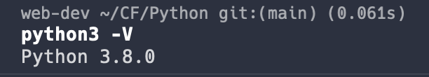

## Set Up a Virtual Environment

Create a new virtualenvironment called achievement2-practice. Confirm it's active in the terminal.

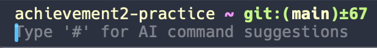

## Install Django

While in virtual environment achievement1-practice, pip install django and check version after install.

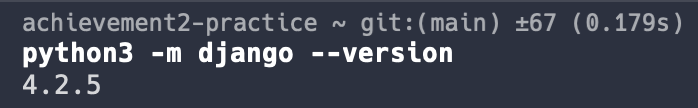

# Exercise 2

1. [Create A2_Recipe_App Folder](#create-a2_recipe_app-folder)
2. [Create a2-ve-recipeapp Virtual Environment](#Create-a2-ve-recipeapp-virtual-environment)
3. [Install Django in Virtual Environment](#install-django-in-virtual-environment)
4. [Create Django Project Named recipe_project](#create-django-project-named-recipe_project)
5. [Rename recipe_project Project Directory src](#rename-recipe_project-project-directory-src)
6. [Run Migrations and Run Rerver](#run-migrations-and-run-sever)
7. [Create SuperUser and Sign In](#create-superuser-and-sign-in)

## Create A2_Recipe_App Folder

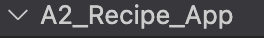

## Create a2-ve-recipeapp Virtual Environment

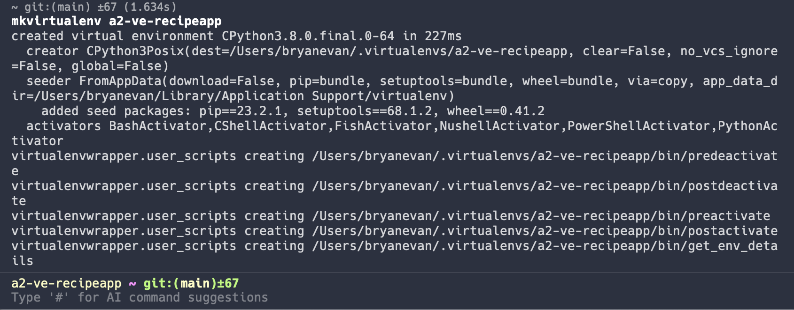

## Install Django in Virtual Environment

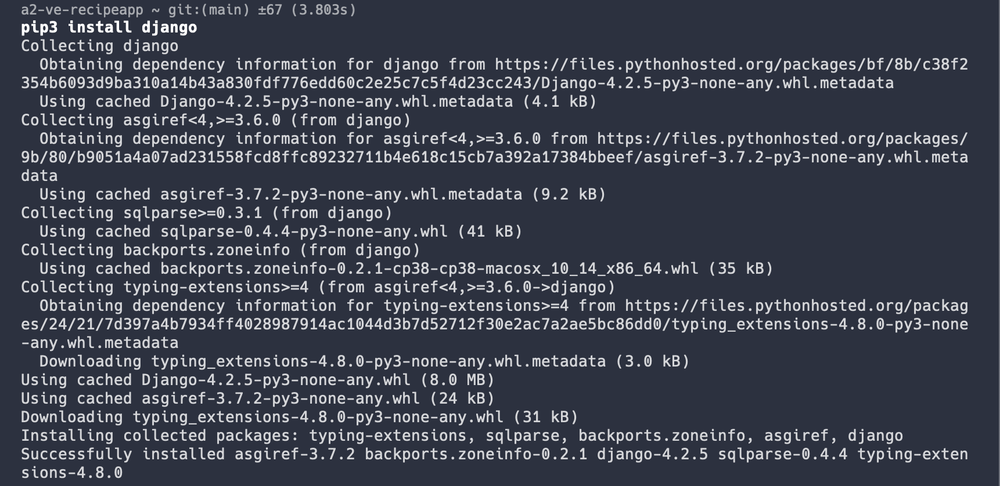

## Create Django Project Named recipe_project

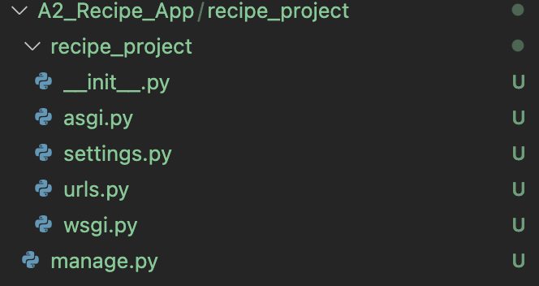

## Rename recipe_project Project Directory src

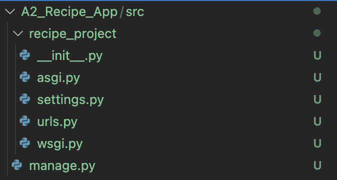

## Run Migrations and Run Rerver

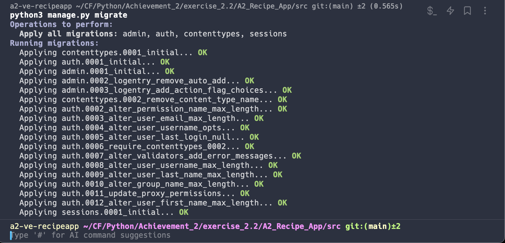
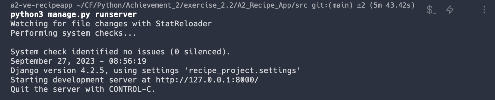

## Create SuperUser and Sign In

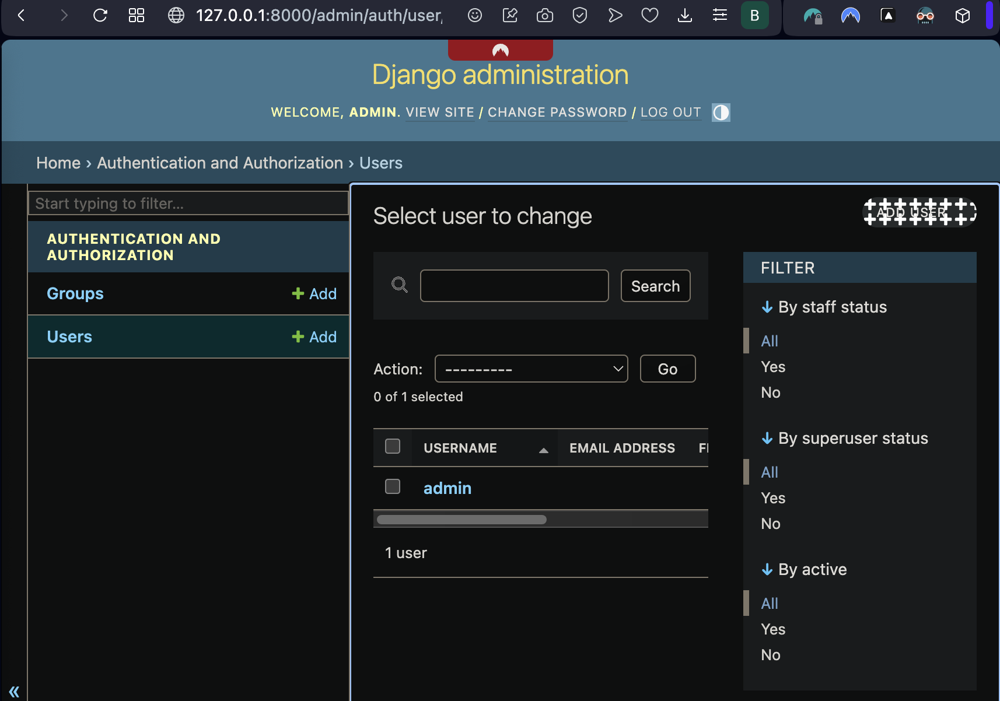

# Exercise 3

## Table of Contents

1. [Create App Schema](#create-app-schema)
2. [Establish Project Structure](#establish-project-structure)
3. [Migrate Models](#migrate-models)
4. [Test Models](#test-models)

## Create App Schema

Identify the desired attributes of each entity and their relation with other entities.

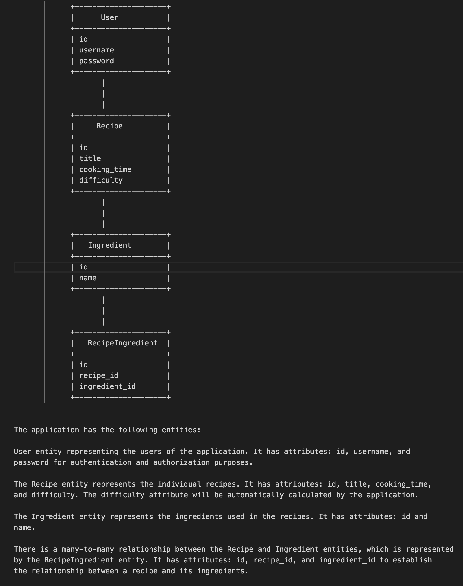

## Establish Project Structure

Create the apps drawn out in the schema and include links to projects in settings.py

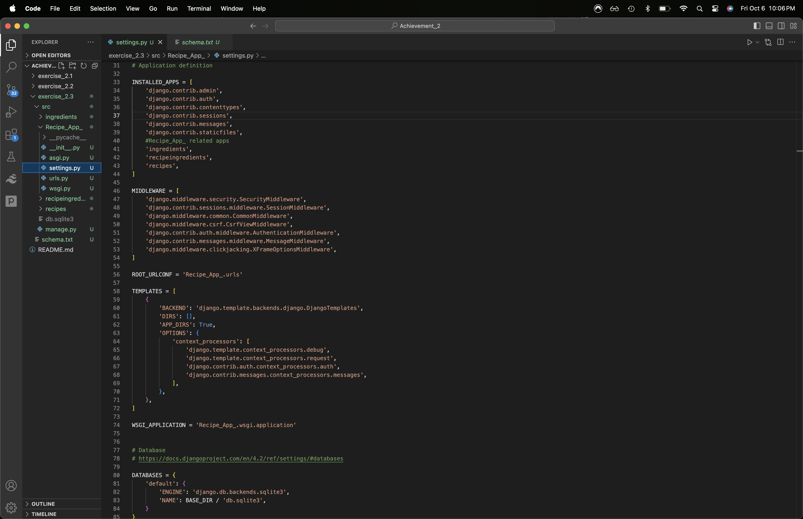

## Migrate Models

After building models within each app, register the models in their respective admin.py, then migrate.

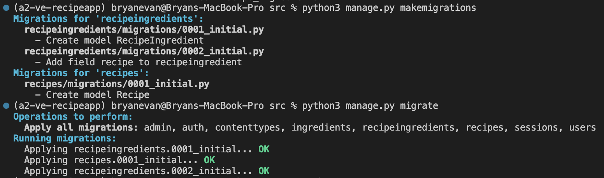

## Test Models

Build tests for all apps, respectively; run tests.

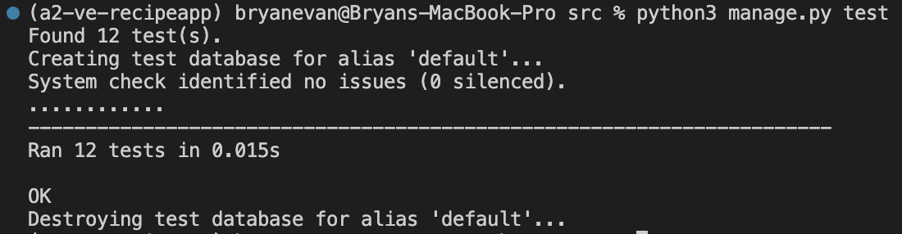

# Exercise 4

## Table of Contents

1. [Create Welcome Page](#creat-welcome-page)

## Create Welcome Page

Modify URLs to send user a welcome page with a basic outline.

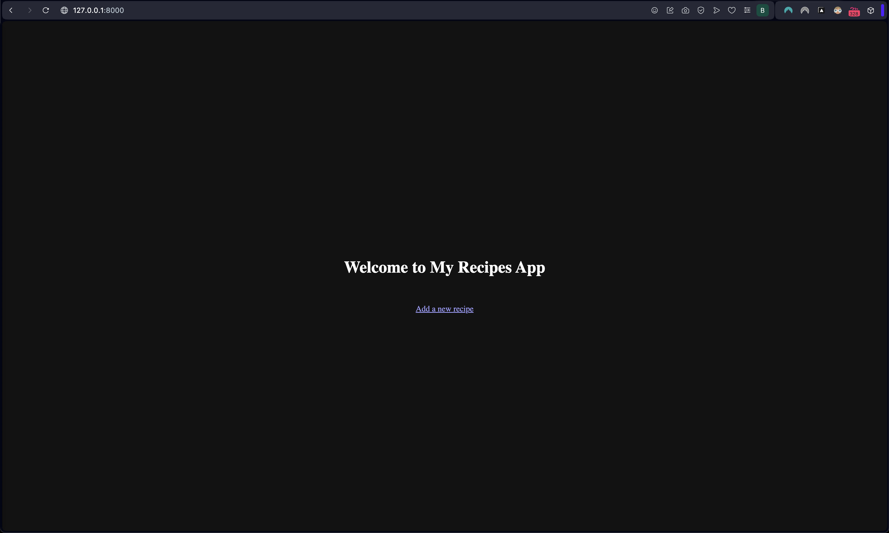

# Exercise 5

## Table of Contents

1. [Update Models](#update-models)
2. [Add Records](#add-records)
3. [Welcome Page](#welcome-page)
4. [Recipe Details](#recipe-details)
5. [Test](#test)

## Update Models

Update neccessary models.py to facilitate url paths.
Update neccessary url.py for path logic.
Update neccessary views.py for path and view logic.

makemigrations, migrate, runserver

## Add Records

Download food images to a new media/recipes directory.
Go into admin panel to update recipes with corresponding images.

## Welcome Page

Create Static directory, set up static routing is settings.py.

Update welcome page for better UI/UX, add a button to route to recipe list view with recipes_list.html template.

## Recipe Details

Create recipes_details.html to display recipe details.

## Test

Test all links and ensure they pass.

# Exercise 6

## Table of Contents

1. [Provide Authentication](#provide-authentication)
2. [Protect Views](#protect-views)
3. [Implement Logout](#implement-logout)
4. [Run Server and Capture Output](#run-server-and-capture-output)

## Provide authentication

Create a login feature for your application. The login page should be accessible from your homepage via the link directly at “http://127.0.0.1:8000/login/”. To achieve this, you need to:
Create a login view.
Create a login template.
Register a view and map URL.
Provide a clickable login link or button on the homepage that routes to the authentication form.
Identify which page you want to protect via authentication and redirect the user to that page after a successful login.

## Protect Views

Identify which views or pages you want to protect via authentication. Then go ahead and add the necessary code at all relevant views to ensure that the page isn’t called if the user isn’t logged in. Access the URLs of the protected views in your browser and make sure that you’re redirected to the login page.

## Implement Logout

Provide a logout link or button on each protected page.
Create a new view and template for your application with the message “You’ve successfully logged out.” Call this success.html.
Provide a link to log back in to success.html.
Create the view and template for logging out.
What other information or feature do you want to place on the success.html page? Go ahead and add it to the template. Be creative!

## Run Server and Capture Output:

Toggle the terminal ON in VSCode and follow the steps to run the server:
Navigate to A2_Recipe_App/src.
Activate the virtual environment: a2-ve-recipeapp.
Execute runserver.
Head to the browser and follow a typical user journey:
User lands at homepage.
User clicks login button.
Authentication form is shown.
User enters username and password.
Information is authenticated and user is redirected to sales page.
User logs out and returns to successful logout page.
